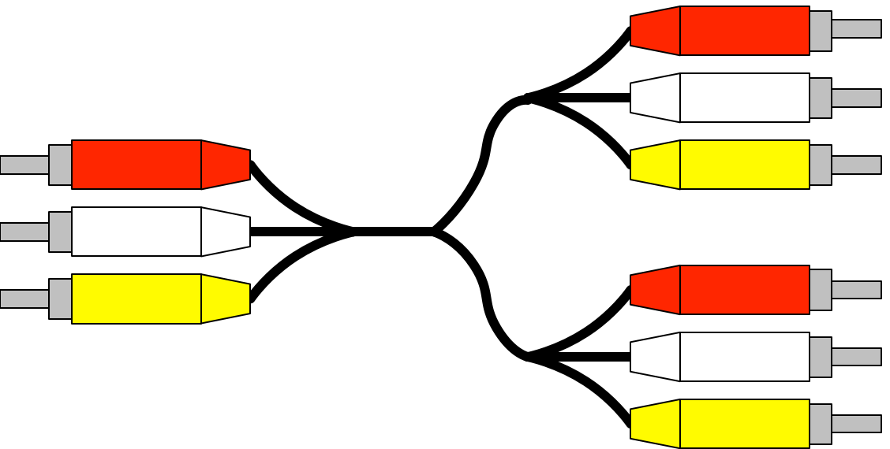

# Agent Splitter



An agent configuration to split an incoming signal into multiple outgoing signals.

Works for metrics, logs, and traces.

## WARNING
This is untested, just a proof of concept at this point (yeah, with a logo).

## Deployment

```
helm install splitter grafana/grafana-agent --set controller.type=deployment --set-file agent.configMap.content=splitter-config.river
```
